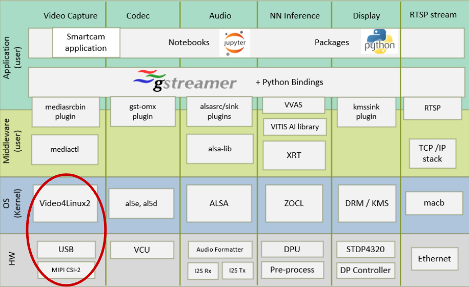
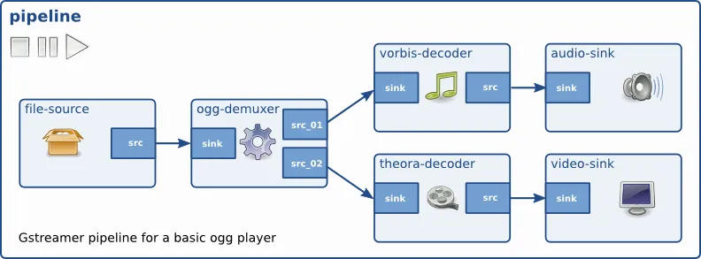
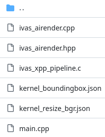
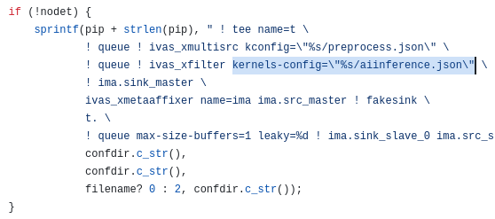
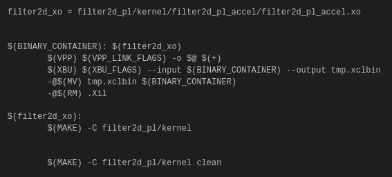
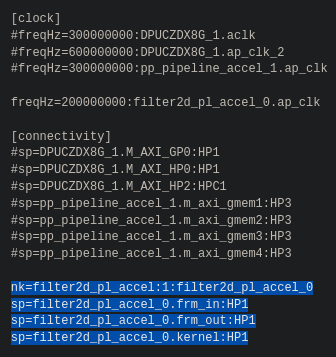

# #+title: 2024-05-19
#+TITLE:     2024/05/23 Progress Report
#+AUTHOR:    Yuri Guimaraes
#+EMAIL:     yuri.kgpps@gmail.com
# #+DATE:      2024-05-19 (Sunday)
#+STARTUP: beamer
#+DESCRIPTION:
#+KEYWORDS:
#+LANGUAGE:  en
#+OPTIONS:   H:2 num:t toc:t \n:nil @:t ::t |:t ^:t -:t f:t *:t <:t
#+OPTIONS:   TeX:t LaTeX:t skip:nil d:nil todo:t pri:nil tags:not-in-toc
#+COLUMNS: %40ITEM %10BEAMER_env(Env) %9BEAMER_envargs(Env Args) %4BEAMER_col(Col) %10BEAMER_extra(Extra)
#+INFOJS_OPT: view:nil toc:nil ltoc:t mouse:underline buttons:0 path:https://orgmode.org/org-info.js
#+EXPORT_SELECT_TAGS: export
#+EXPORT_EXCLUDE_TAGS: noexport
#+HTML_LINK_UP:
#+HTML_LINK_HOME:
#+startup: beamer
#+LaTeX_CLASS: beamer
#+LaTeX_CLASS_OPTIONS: [allowframebreaks]
#+latex_header: \mode<beamer>{\usetheme{Madrid}}
# #+latex_header: \mode<beamer>{\useoutertheme{miniframes}}
# #+latex_header: \AtBeginSection[]{\begin{frame}<beamer>\frametitle{Topic}\tableofcontents[currentsection]\end{frame}}
# #+BIND: org-beamer-frame-default-options "allowframebreaks"
# -*- org-export-allow-bind-keywords:t

* Summary
** Summary
# :PROPERTIES:
# :BEAMER_env: block
# :BEAMER_col: 0.6
# :END:
*** Task List
1. +Browse ~smartcam~ module source code.+
2. +Compile ~smartcam~ code.+
3. +Modify ~smartcam~ code to use other kernels.+
4. *Write image compression $\rightarrow$ storage prototype pipeline.*
*** @@latex:@@
:PROPERTIES:
:BEAMER_env: ignoreheading
:END:

** Recap (1 / 2)
Xilinx's Smart Camera application allows for a

~MIPI capture~ $\rightarrow$ ~PL processing~ $\rightarrow$ ~RTSP/DP output~ pipeline.
https://xilinx.github.io/kria-apps-docs/kv260/2022.1/build/html/_images/sc_image_landing.jpg

** Recap (2 / 2)
This is done via a GStreamer-Video4Linux2 driver.

** Objectives
*** Runtime
- What is v4l2's role in acquiring the image from DMA?
- How does GStreamer use v4l2?
- How does an acceleration kernel run using v4l2/GStreamer?

*** Building
- What does the final software depend on?
- What does the developer need to have ready in order to build the application?
  - Dependencies?

# ** Planning
# ** Progress
* Hardware-Software Architecture
** MIPI-CSI2 Capture (Hardware)
*** Col left
:PROPERTIES:
:BEAMER_col: 0.4
:END:
- MIPI source outputs to ~S_AXI_HP0_FPD~.
- ~NV12~ format.
*** @@latex:@@
:PROPERTIES:
:BEAMER_env: block
:BEAMER_col: 0.6
:END:
# YUV420: Planar 8-bit YUV 4:2:0
# NV12:   *Semi*-planar 8-bit YUV 4:2:0
| NV12   | Planar 8-bit YUV 4:2:0        |
| YUV420 | *Semi*-planar 8-bit YUV 4:2:0 |

*** @@latex:@@
:PROPERTIES:
:BEAMER_env: block
:BEAMER_opt: [t]
:END:
#+CAPTION:      MIPI Capture Pipeline
[[https://xilinx.github.io/kria-apps-docs/kv260/2022.1/build/html/_images/hw_cap_pp1.png]]
** MIPI-CSI2 Capture (Software) (1 / 2)
*** Col left
:PROPERTIES:
:BEAMER_col: 0.3
:END:
- Source accessible via ~v4l2~

  \rightarrow ~/dev/media*~

  \rightarrow ~/dev/video*~

  ...

  \rightarrow ~v4l2src~

  \rightarrow ~mediasrc~
*** Col right
:PROPERTIES:
:BEAMER_col: 0.7
:END:
#+CAPTION:      Video Capture Diagram
#+ATTR_LATEX:   :height 0.7\textheight
[[https://xilinx.github.io/kria-apps-docs/kv260/2022.1/build/html/_images/video_capture1.png]]
** MIPI-CSI2 Capture (Software) (2 / 2)
#+CAPTION:      GStreamer Pipeline
[[https://xilinx.github.io/kria-apps-docs/kv260/2022.1/build/html/_images/software-overall-data-flow1.png]]
** Acceleration
Acceleration on the new stack is based on HLS kernels. For vision, there is ~VVAS~.
The Smart Camera application uses ~VVAS~ with ~GStreamer~.
*** VVAS
[[https://www.xilinx.com/products/design-tools/vitis/vvas.html][Vitis Video Analytics SDK]] is Xilinx's software stack for building video processing applications.
*** Plugin Structure
Use *GStreamer* plugins for creating computer vision pipelines.

* GStreamer
** GStreamer
:PROPERTIES:
:BEAMER_env: quotation
:END:
#+BEGIN_QUOTE
GStreamer is a pipeline-based multimedia framework linking various media processing systems to create workflows.
#+END_QUOTE
#+CAPTION: Example of a GStreamer pipeline.

** GStreamer Basics
*** Elements
Objects derived from ~GstElement~. Examples:
- ~source~ element: provides data
- ~filter~ element: acts on incoming data
*** Pads
Objects derived from ~GstPad~. They are the "ports" that intermediate data between elements.
- /Source/ pad: data flows outward
- /Sink/ pad: data flows inward
*** Buffers
- ~GstMiniObject~, ~GstBuffer~, ~GstEvent~...

** GStreamer Plugins
- Enables plug-and-play functionality with GStreamer.
- Elements must be wrapped into a plugin before being used.
*** What is a plugin?
Essentially, it is a block of loadable code (a shared object/dynamically linked library).
*** What is the structure of a plugin?
[[https://gitlab.freedesktop.org/gstreamer/gst-template.git]]
- The above serves as good reference.
- The compiled code generates a ~libgstplugin.so~, which can be loaded by ~gst-launch-1.0~ by simply specifying the path in ~GST_PLUGIN_PATH~.

** VVAS
- Collection, as well as an API for creating acceleration kernels for usage with GStreamer.
#+CAPTION: How VVAS relates to GStreamer
#+ATTR_LATEX:   :height 0.6\textheight
[[https://xilinx.github.io/VVAS/1.0/build/html/_images/core-API-functions.png]]

** VVAS Usage in GStreamer (1 / 2)
API usage:
1. Plugin Initialization (~xlnx_kernel_init~)
2. Kernel Start (~xlnx_kernel_start~)
3. Waiting for the kernel to finish (~vvas_kernel_done~)
4. Denitilizating the plugin (~xlnx_kernel_deinit~)

** VVAS Usage in GStreamer (2 / 2)
*** col1
:PROPERTIES:
:BEAMER_col: 0.4
:END:
[[https://xilinx.github.io/VVAS/main/build/html/docs/common/gstreamer_plugins/plugin_vvas_xfilter.html][~vvas_xfilter~]]:\\
**** JSON config
Contains information regarding:
- ~xclbin~ location
- ~vvas-library-repo~
- ~element-mode~ (passthrough, inplace, transform)
**** ~xclbin~
Used to program the FPGA.

*** col2
:PROPERTIES:
:BEAMER_col: 0.6
:END:

#+CAPTION: ~xfilter~ usage.
#+ATTR_LATEX:   :height 0.6\textheight
[[https://xilinx.github.io/VVAS/main/build/html/_images/xfilter_plugin1.png]]
* Source Code Analysis
** Smart Camera --- Folder Structure
- [[https://github.com/Xilinx/smartcam/tree/2021.1][~smartcam~]]: Contains the base smartcam application.
  It is built and used with Docker.
*** col1 :BMCOL:
:PROPERTIES:
:BEAMER_col: 0.4
:END:

*** ~smartcam/src~ :B_block:
:PROPERTIES:
:BEAMER_col: 0.6
:BEAMER_env: block
:END:
~ivas_airender~: aadasda\\
~ivas_xpp_pipeline~: aadasda\\
~main~: Contains the GStreamer pipelines that run everything.

** VVAS Usage in ~smartcam~
[[https://xilinx.github.io/VVAS/main/build/html/docs/common/gstreamer_plugins/plugin_vvas_xfilter.html][~vvas_xfilter~]]: Plugin to act directly on data with the specified kernel.
#+ATTR_LATEX:   :height 0.6\textheight

** VVAS Example --- Edge Filter with ~filter2d~ (1 / 3)
- *[[https://github.com/Xilinx/vck190-base-trd/tree/2022.1/overlays/filter2d/kernels/filter2d_pl/][~filter2d~ source code]]*
*** Makefile :BMCOL:
#+ATTR_LATEX:   :height 0.6\textheight

** VVAS Example --- Edge Filter with ~filter2d~ (2 / 3)
- *[[https://github.com/Xilinx/vck190-base-trd/tree/2022.1/overlays/filter2d/kernels/filter2d_pl/][~filter2d~ source code]]*
*** PS Connectivity
#+ATTR_LATEX:   :height 0.6\textheight

** VVAS Example --- Edge Filter with ~filter2d~ (3 / 3)
*** Launching GStreamer with filter2d kernel :B_exampleblock:
:PROPERTIES:
:BEAMER_env: exampleblock
:END:
#+BEGIN_SRC sh
gst-launch-1.0 v4l2src \
  device=/dev/video0 io-mode=mmap !\
  "video/x-raw, width=640, height=480" !\
  videoconvert !\
  "video/x-raw, width=640, height=480,
   format=YUY2, framerate=30/1" !\
  vvas_xfilter kernels-config=/tmp/kernel_xfilter2d_pl.json\
  dynamic-config='{ "filter_preset" : "edge" }' !\
  perf ! kmssink plane-id=39 fullscreen-overlay=true -v
#+END_SRC

# #+RESULTS:
** VVAS Example --- Results of the Edge Filter

* Conclusion
** Conclusion
- Got smartcamera to work on Docker inside the KV260
  - It also worked with a modified kernel
- Next: *Write image compression $\rightarrow$ storage prototype pipeline?*
- I'm also working on making the build process for these packages simple.
** Appendix
*** AIBox-ReID
Xilinx demo for 4k IP cameras as inputs on the KV260.
[[https://xilinx.github.io/kria-apps-docs/kv260/2022.1/build/html/_images/aib_image_landing.jpg]]
** Appendix
*** AI Box Distributed ReID
Distributed demo.
[[https://xilinx.github.io/kria-apps-docs/kv260/2022.1/build/html/_images/aibox-dist-landing.png]]
